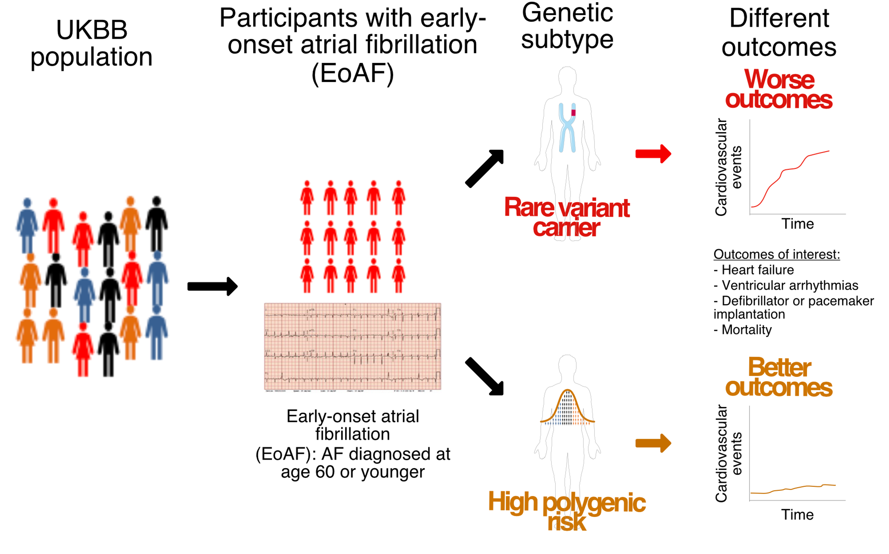
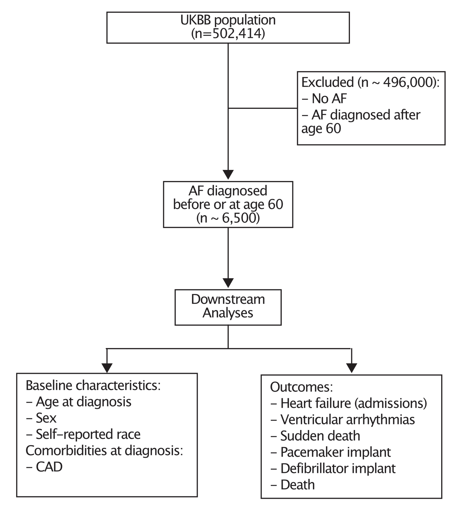

# 🫀 Early Onset Atrial Fibrillation (AF) – UK Biobank

This repository provides the workflow for extracting, phenotyping, and analyzing 
**early onset atrial fibrillation** data in the UK Biobank Research Analysis 
Platform (RAP).

---

## 📊 Data Extraction
1. Open a new **Python notebook session** in the UK Biobank RAP.
2. Clone the GitHub repository: `git clone https://github.com/nicksunderland/early_onset_af.git`
3. Open: `scripts/extract_ukbb_data.ipynb`
4. Run the code chunks to extract the data into your work space.
5. Close the session once extraction is complete.

## 🧬 Phenotyping
1. Open a new **R session** in the UK Biobank RAP.
2. Clone the GitHub repository: `git clone https://github.com/nicksunderland/early_onset_af.git`
3. Open: `scripts/af_phenotyping.R`
4. Run the script to save the AF cohort to your work space.

## 📈 Analysis
1. Open: `scripts/af_analysis.R`
2. Run/edit the script to perform the analyses 

## 📝 Plan

