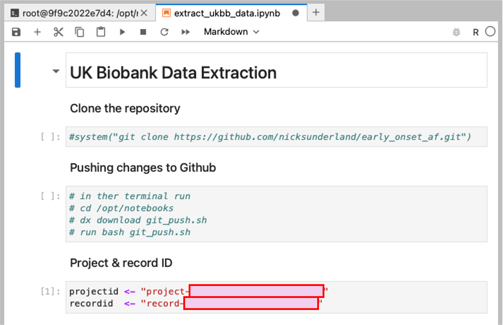

# 🫀 Early Onset Atrial Fibrillation (AF) – UK Biobank

This repository provides the workflow for extracting, phenotyping, and analyzing 
**early onset atrial fibrillation** data in the UK Biobank Research Analysis 
Platform (RAP).

---

## 📊 Data Extraction
1. Open a new **Python notebook session** in the UK Biobank RAP.
2. Clone the GitHub repository: `git clone https://github.com/nicksunderland/early_onset_af.git`
3. Open: `scripts/extract_ukbb_data.ipynb`
4. Run the code chunks to extract the data into your work space.
5. Close the session once extraction is complete.

## 🧬 Phenotyping
1. Open a new **R session** in the UK Biobank RAP.
2. Clone the GitHub repository: `git clone https://github.com/nicksunderland/early_onset_af.git`
3. Open: `scripts/af_phenotyping.R`
4. Run the script to save the AF cohort to your work space.

## 📈 Analysis
1. Open: `scripts/af_analysis.R`
2. Run/edit the script to perform the analyses 

## 📝 Hypothesis / plan

---

## Set up
Login to the UK Biobank RAP

### Open / create project
If you already have a UK Biobank project (e.g. `HERMES3` in my example), open this. Otherwise create a new project by clicking on the `+ New Project` button.

  

### Opening JupyterLab
Open a JupyterLab session by clicking on the `Tools` tab, then select `JupyterLab`, then `+ New JupyterLab`. 

#### Open

  

  

#### Define
Define the session by first selecting you project, then the instance type (mem1_hdd1_v2_x4 should be sufficient for the data extraction process, 
but more memory and cores will be required for the analysis steps), and duration (2 hours should be fine).

  

### Waiting for JupyterLab
The JupyterLab session can take some time to load (up to 30 mins!), especially if not many cores are requested for the session. To monitor setup progress, 
navigate to your project (`PROJECTS` > `project_name` > `MONITOR`). You will see the job state as 'Waiting'. 

#### Monitoring job

  

#### Opening job
Once the job state changes to 'Running' you will be able to click on it and `Open Worker URL`. 

  

  

#### Error messages
It is likely that if clicked too early, you'll get an error message - this is just because the setup has not completed.  

  

#### Viewing log / progress
To view the setup progress, click `View Log`.  

  

  

### JupyterLab
Once the setup has completed, retry opening the URL and the JupyterLab session should start. First open the `Terminal` app. 

#### Terminal App

  

#### Git clone
Clone this GitHub repository into the session using: `git clone https://github.com/nicksunderland/early_onset_af.git`

  

#### Data extraction script
Navigate to the data extraction script and open it `/early_onset_af/scripts/extract_ukbb_data.ipynb`. 

  

#### Project and Record IDs
In the script, you will need to change the project and record IDs to your own. 

  

##### Project ID
The project ID can be found on the RAP under projects. Click on your project to show the details in the side bar on the right. 
Don't click directly on the project name (this opens the project).

  

##### Record ID
The record ID can be found within your project. Click on your project to opens it, then find the `.dataset` file. 
Select this to show the details in the side bar on the right.

  

### Run data extraction
Run the data extraction script by placing your cursor in the first code box, then click the `play` button to execute each code block. 
A `[*]` next to the code block indicates that the code is running. A number, e.g. `[1]` indicates that code block has finished.  

At the end, several `Table Exporter` jobs should have been created, these can be viewed in the `MONITOR` tab on the RAP 
(`PROJECTS` > `project_name` > `MONITOR`). Once these have been created, you can terminate the JupyterLab session.   

  

